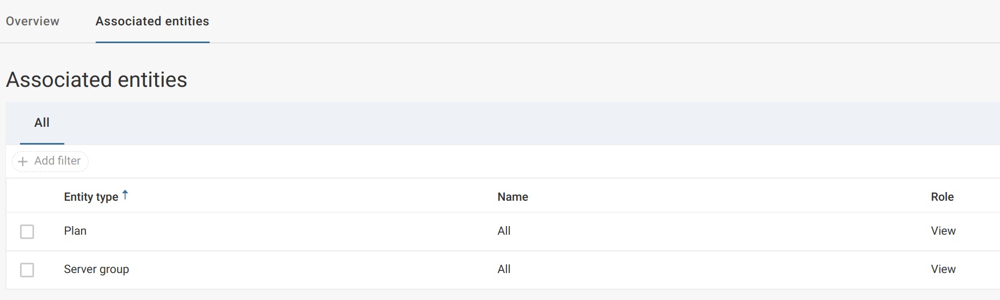
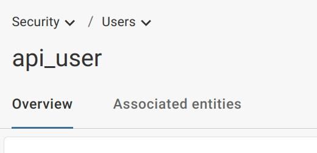
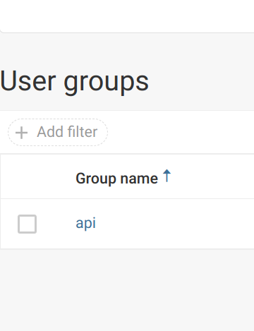

# Commvault Backup and Recovery Exporter for Prometheus

[](https://lgtm.com/projects/g/marcinbojko/commvault_exporter/alerts/)
[](https://github.com/marcinbojko/commvault_exporter/actions/workflows/01_lint_me.yml)

<!-- TOC -->

- [Commvault Backup and Recovery Exporter for Prometheus](#commvault-backup-and-recovery-exporter-for-prometheus)
  - [What is it](#what-is-it)
    - [Metrics](#metrics)
    - [Commvault presented fields and labels](#commvault-presented-fields-and-labels)
      - [VM](#vm)
  - [Tested with](#tested-with)
  - [Usage](#usage)
    - [Commvault configuration](#commvault-configuration)
      - [In Commvault, create a user group and assign permissions first Security/User Group](#in-commvault-create-a-user-group-and-assign-permissions-first-securityuser-group)
      - [Create user Security/Users](#create-user-securityusers)
      - [The assign user to a group](#the-assign-user-to-a-group)
    - [Configuration](#configuration)
    - [Docker-compose example](#docker-compose-example)
    - [Prometheus scrape example](#prometheus-scrape-example)
  - [To DO](#to-do)
  - [Tests](#tests)
  - [About](#about)

<!-- /TOC -->

## What is it

Commvault exporter is a small Python3 script exposing backup  metrics from `Commvault Backup and Recovery` [https://www.commvault.com/complete-data-protection/backup-and-recovery](https://www.commvault.com/complete-data-protection/backup-and-recovery). It uses Commvault's API to get as much needed information about hosts statuses wrapping these in labels provided by Commvault Backup and Recovery itself.
It can be used as a stats tool for:

- statuses of VM's backups (protected or not)
- tatuses object storage backups
- SLA criteria met

### Metrics

- `commvault_exporter_vm` - Gauge - returns virtual machines list with their statuses
  - statuses
    - 0 - all
    - 1 - protected
    - 2 - non-protected
    - 3 - pending
    - 4 - errors in backup
    - 5 - discovered
    - 6 - unknown
- `commvault_exporter_vm_request_time_seconds` - Gauge - returns time needed to do a  `webconsole/api/VM` query
- `commvault_exporter_vm_count` - Gauge - returns lists of VMs in Commvault inventory
- `commvault_exporter_vm_statuse` - Gauge - returns lists of hosts in all available statuses


### Commvault presented fields and labels

#### VM
|commvaults api field|prometheus label|
|-----------------|----------------|
|name|name|
|vmStatus|status|
|subclientName|subclient_name|
|plan.planName|plan|
|strGUID|strGUID|
|slaStatus|sla_status|
|lastBackupJobInfo.status|last_backup_job_status|
|vmSize|vm_size|
|vmUsedSpace|vm_used_space|

## Tested with

- Commvault Backup and Restore 11.28.xx

## Usage

### Commvault configuration

To use access to API you need an user with at least 'viewer' role for VMs, Plans,

#### In Commvault, create a user group and assign permissions first (Security/User Group)



#### Create user (Security/Users)


#### The assign user to a group



### Configuration

Create a set of environment variables. All variables are required.

```ini
# commvault host name
COMMVAULT_REQUEST_URI=https://commvault.home.lan
# commvault user
COMMVAULT_REQUEST_USER=api
# commvault password in base64 format (No plain text)
COMMVAULT_REQUEST_PASSWORD=api
# if commvault server has trusted cert
COMMVAULT_REQUEST_TLS_VERIFY=false
# timeout for our requests
COMMVAULT_REQUEST_TIMEOUT=60
# how frequently repeat requests, in seconds
COMMVAULT_REQUEST_INTERVAL=120
```

### Docker-compose example

```yaml
version: "3.8"
services:
  commvault_exporter:
    image: marcinbojko/commvault_exporter:latest
    ports:
     - "8000:8000"
    env_file:
      ./commvault_exporter.env
```

### Prometheus scrape example

```yaml
- job_name: 'commvault_exporter'
  scrape_interval: 300s
  honor_labels: true
  metrics_path: '/'
  scheme: http
  static_configs:
    - targets:
      - 'commvault_exporter:8000'
      labels:
        app: "commvault-exporter"
        env: "int"
        team: "it"
```

## To DO

- add more API checks (storage objects and databases)

## Tests

- pyreq
- isort
- flake8
- pylint
- pylance

## About

Marcin Bojko

[https://bojko.dev](https://bojko.dev)
